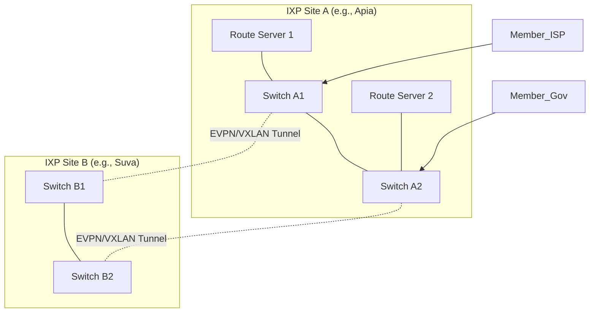

# Pacific Islands Internet Exchange (PacIX) Reference Design


## 🌴 Project Overview

**PacIX** is an open-source, turnkey network architecture designed for deploying Internet Exchange Points (IXPs) in the Pacific Islands and similar emerging markets. 

Designed for resource-constrained environments with high latency and limited local technical expertise, this reference design provides a **modern, scalable, and secure** foundation for local traffic exchange. It moves away from legacy Layer 2 spanning-tree designs to a robust **EVPN/VXLAN** fabric, ensuring stability across geographic distances (e.g., interconnecting islands).

### 🎯 Target Audience
*   **Network Operators** in the Pacific (Samoa, Fiji, Tonga, Vanuatu, etc.).
*   **Grant Funders (ISOC, APNIC)** looking for standardized deployment models.
*   **Emerging IXPs** globally seeking a "best-practice" template.

---

## 🏗 Technical Architecture

This design utilizes a **Collapsed Core** topology with an **EVPN/VXLAN** control plane. This allows the exchange fabric to stretch across multiple physical sites (data centers or islands) without the risks associated with Spanning Tree Protocol (STP).

### Key Features
*   **Hardware Agnostic:** Complete configurations provided for **Arista EOS**, **Juniper QFX**, and **EdgeCore (OcNOS)**.
*   **Dual-Stack:** Native IPv4 and IPv6 peering support from day one.
*   **MANRS Compliant:** Built-in security (RPKI, IRR filtering, Anti-spoofing).
*   **Automated:** Integrated with **IXP Manager** for provisioning and member portals.
*   **Resilient:** Active-Active Route Servers and redundant switching fabric.

### High-Level Topology



---

## 📂 Repository Structure

The repository is organized to guide you from planning to operations.

```text
pacix-reference-design/
├── BOM.csv                    # Hardware Bill of Materials & Cost Estimates
├── configs/                   # Production-ready Device Configurations
│   ├── switches/              # Arista, Juniper, & EdgeCore templates
│   └── routeservers/          # BIRD 2.x and GoBGP configurations
├── docs/                      # Technical Documentation
│   ├── 01-high-level-design.md
│   ├── 02-addressing-plan.md
│   └── 03-security-hardening.md
├── runbooks/                  # Operational SOPs
│   ├── member-onboarding.md   # How to connect a new ISP
│   ├── incident-response.md   # What to do when things break
│   └── maintenance.md         # Upgrades and backup procedures
└── templates/                 # Administrative Templates
    ├── apnic-resource-request.md
    └── ixp-manager-docker-compose.yml
```

---

## 🚀 Getting Started

### Phase 1: Planning & Procurement
1.  Review the **[High Level Design](docs/01-high-level-design.md)** to understand the topology.
2.  Select your hardware vendor using the **[Bill of Materials](BOM.csv)**.
3.  Request IP resources using the **[APNIC Request Template](templates/apnic-resource-request.md)**.

### Phase 2: Implementation
1.  **Rack & Power:** Install switches and servers according to the site plan.
2.  **Switch Config:** Navigate to `configs/switches/`, select your vendor, and apply the `base-config`.
    *   *Note:* Update the `VTEP IPs` and `Router IDs` per the addressing plan.
3.  **IXP Manager:** Deploy the management platform using the **[Docker Guide](templates/ixp-manager-setup.md)**.
4.  **Route Servers:** Install BIRD 2.x and apply the configs from `configs/routeservers/bird/`.

### Phase 3: Operations
1.  Follow the **[Member Onboarding Runbook](runbooks/member-onboarding.md)** to connect your first peer.
2.  Verify security using the **[Hardening Checklist](docs/03-security-hardening.md)**.

---

## 🛡 Security & Compliance

This design is strictly aligned with **MANRS (Mutually Agreed Norms for Routing Security)** for IXPs.

| Feature | Implementation |
| :--- | :--- |
| **Action 1: Prevent Propagation of Incorrect Routing** | Route Servers configured with RPKI (Routinator) and IRR filtering. |
| **Action 2: Prevent Traffic with Spoofed Source IP** | Strict uRPF and ACLs on switch ports; No Proxy-ARP. |
| **Action 3: Protect the Peering Platform** | BPDU Guard, Storm Control, IPv6 RA Guard, Port Security. |
| **Action 4: Facilitate Global Communication** | Standard contact info published in PeeringDB (via IXP Manager). |
| **Action 5: Provide Monitoring and Debugging** | Looking Glass and public traffic statistics enabled. |

---

## 🤝 Contributing

We welcome contributions from network engineers globally!
1.  **Fork** the repository.
2.  Create a feature branch (e.g., `feature/cisco-nexus-configs`).
3.  Submit a **Pull Request** detailing the changes.

Please ensure all network configurations are validated against a virtual lab (e.g., GNS3, EVE-NG, or Containerlab) before submission.

---

## 📄 License & Acknowledgments

**License:**
*   Documentation: [CC-BY-SA 4.0](https://creativecommons.org/licenses/by-sa/4.0/)
*   Code/Configs: [MIT License](LICENSE)

**Acknowledgments:**
*   Based on best practices from **Euro-IX** and **APNIC**.
*   Inspired by the open-source community behind **IXP Manager** and **BIRD**.
*   Dedicated to the network operators connecting the Blue Pacific.
