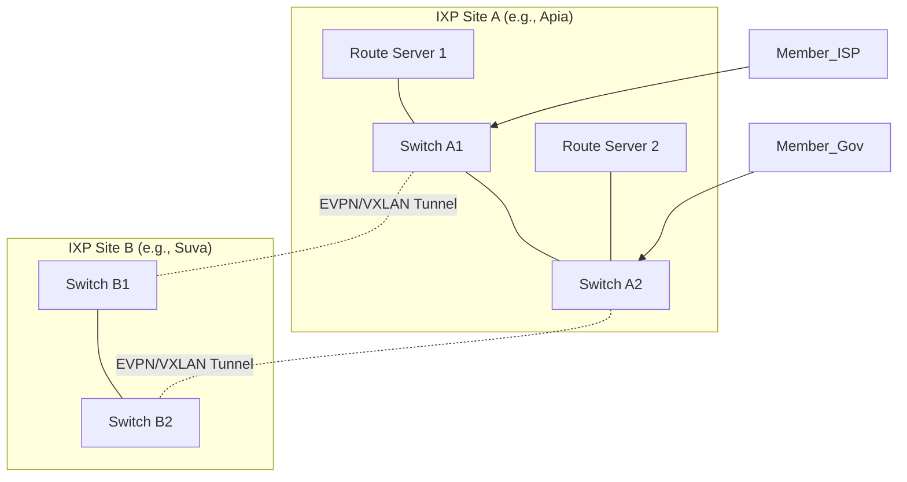

# Pacific Islands Internet Exchange (PacIXP) Reference Design


## 🌴 Project Overview

This is an open-source, turnkey network architecture designed for deploying Internet Exchange Points (IXPs) in the Pacific Islands and similar emerging markets. 

Designed for resource-constrained environments with high latency and limited local technical expertise, this reference design provides a **modern, scalable, and secure** foundation for local traffic exchange. It moves away from legacy Layer 2 spanning-tree designs to a robust **EVPN/VXLAN** fabric, ensuring stability across geographic distances (e.g., interconnecting islands).

### 🎯 Target Audience
*   **Network Operators** in the Pacific (Samoa, Fiji, Tonga, Vanuatu, etc.).
*   **Grant Funders (ISOC, APNIC)** looking for standardized deployment models.
*   **Emerging IXPs** globally seeking a "best-practice" template.

---

## 🏗 Technical Architecture

This design utilizes a **Collapsed Core** topology with an **EVPN/VXLAN** control plane. This allows the exchange fabric to stretch across multiple physical sites (data centers or islands) without the risks associated with Spanning Tree Protocol (STP).

### Key Features
*   **Hardware Agnostic:** Reference configurations provided for **Arista EOS** and **Juniper QFX**, with the architecture designed to be vendor-neutral.
*   **Dual-Stack:** Native IPv4 and IPv6 peering support from day one.
*   **MANRS Compliant:** Built-in security (RPKI, IRR filtering, Anti-spoofing).
*   **Automated:** Integrated with **IXP Manager** for provisioning and member portals.
*   **Resilient:** Active-Active Route Servers and redundant switching fabric.

### High-Level Topology


```mermaid
graph TD
    subgraph "IXP Site A (e.g., Apia)"
        SW1[Switch A1] --- SW2[Switch A2]
        RS1[Route Server 1] --- SW1
        RS2[Route Server 2] --- SW2
    end

    subgraph "IXP Site B (e.g., Suva)"
        SW3[Switch B1] --- SW4[Switch B2]
    end

    SW1 -.-|EVPN/VXLAN Tunnel| SW3
    SW2 -.-|EVPN/VXLAN Tunnel| SW4
    
    Member_ISP --> SW1
    Member_Gov --> SW2
```

---

## 📂 Repository Structure

The repository is organized to guide you from planning to operations.

```text
pacixp/
├── TODO.md                              # Open work items
├── configs/
│   └── switches/
│       ├── arista_sw1.md               # Arista EOS reference configuration
│       └── juniper_sw1.md              # Juniper QFX reference configuration
├── docs/
│   ├── 00-design-principles.md         # Governing principles — read before making changes
│   ├── 01-high-level-design.md         # Architecture, topology, and addressing plan
│   ├── 03-security-hardening.md        # MANRS compliance and hardening checklist
│   └── 05-ixp-manager.md               # IXP Manager Docker deployment guide
├── labs/
│   ├── README.md                        # Lab setup instructions
│   ├── pacixp.clabs.yml                 # Containerlab topology definition
│   └── configs/                         # Lab switch, route server, and member configs
├── runbooks/
│   └── ixp-manager-arista-switch.md    # Integrating an Arista switch with IXP Manager
├── strategy/
│   ├── automation.md                    # Automation philosophy and scope
│   ├── onboarding.md                    # Member onboarding workflow and training
│   └── virtualization.md               # VM/container infrastructure strategy
└── templates/
    └── ixp-manager-docker-compose.yml  # Docker Compose for IXP Manager
```

---

## 🚀 Getting Started

### Phase 1: Planning & Procurement
1.  Read the **[Design Principles](docs/00-design-principles.md)** — these govern every architectural decision in this repo.
2.  Review the **[High Level Design](docs/01-high-level-design.md)** to understand the topology and addressing plan.
3.  Contact **APNIC** (or your local NIR) to obtain a public ASN, IPv4 /24, and IPv6 /48 before any hardware is ordered. See DP-12 in the design principles for the full list of required allocations.

### Phase 2: Implementation
1.  **Rack & Power:** Install switches and servers according to the site plan.
2.  **Switch Config:** Navigate to `configs/switches/`, select your vendor, and apply the `base-config`.
    *   *Note:* Update the `VTEP IPs` and `Router IDs` per the addressing plan.
3.  **IXP Manager:** Deploy the management platform using the **[Docker Guide](docs/05-ixp-manager.md)**.
4.  **Route Servers:** Install BIRD 2.x. Use `labs/configs/rs1.cfg` as the starting-point template and adapt filters per the **[Security Hardening Guide](docs/03-security-hardening.md)**.

### Phase 3: Operations
1.  Follow the **[Member Onboarding Guide](strategy/onboarding.md)** to connect your first peer.
2.  Verify security using the **[Hardening Checklist](docs/03-security-hardening.md)**.

---

## 🛡 Security & Compliance

This design is strictly aligned with **MANRS (Mutually Agreed Norms for Routing Security)** for IXPs.

| Feature | Implementation |
| :--- | :--- |
| **Action 1: Prevent Propagation of Incorrect Routing** | Route Servers configured with RPKI (Routinator) and IRR filtering. |
| **Action 2: Prevent Traffic with Spoofed Source IP** | Strict uRPF and ACLs on switch ports; No Proxy-ARP. |
| **Action 3: Protect the Peering Platform** | BPDU Guard, Storm Control, IPv6 RA Guard, Port Security. |
| **Action 4: Facilitate Global Communication** | Standard contact info published in PeeringDB (via IXP Manager). |
| **Action 5: Provide Monitoring and Debugging** | Looking Glass and public traffic statistics enabled. |

---

## 🤝 Contributing

We welcome contributions from network engineers globally!
1.  **Fork** the repository.
2.  Create a feature branch (e.g., `feature/cisco-nexus-configs`).
3.  Submit a **Pull Request** detailing the changes.

Please ensure all network configurations are validated against a virtual lab (e.g., GNS3, EVE-NG, or Containerlab) before submission.

---

## 📄 License & Commercial Support

This project is licensed under the **CC BY-NC-SA 4.0** (Creative Commons Attribution-NonCommercial-ShareAlike) license.

### 🤝 For Community IXPs
**We believe in the open Internet.** If you are a non-profit, cooperative, or community-governed IXP (even if you charge standard port fees to cover costs), you are **free to use, modify, and deploy** this architecture without restriction. We only ask that you credit the PacIXP project.

### 💼 For Commercial Users
**Commercial use requires a separate paid license.** Any use by commercial entities — including for-profit data centers, commercial carriers, or paid consultants using this design to deliver client projects — is **not permitted under the CC BY-NC-SA license** and requires a commercial license from **IEISI**, for which a substantial fee applies.

Contact **tcs@ieisi.org** for commercial licensing terms and paid support options.

**Acknowledgments:**
*   Based on best practices from **Euro-IX** and **APNIC**.
*   Inspired by the open-source community behind **IXP Manager** and **BIRD**.
*   Dedicated to the network operators connecting the Blue Pacific.
