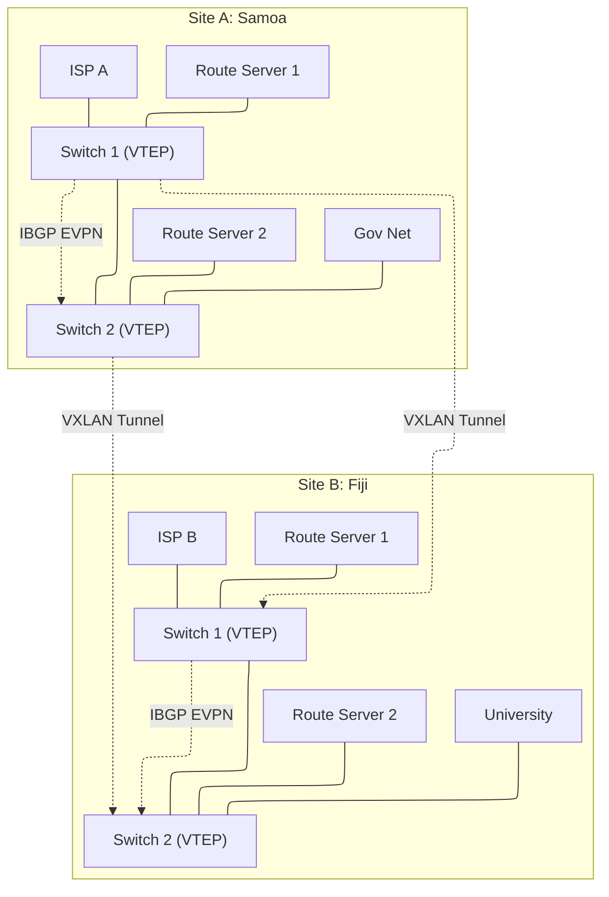

# PacIXP High-Level Design (HLD)

| Document Details | |
| :--- | :--- |
| **Project** | Pacific Islands Internet Exchange (PacIXP) |
| **Version** | 1.0 (Release Candidate) |
| **Status** | Engineering Review |
| **Architecture** | EVPN-VXLAN Collapsed Core |
| **Compliance** | MANRS, Euro-IX BCP |

---

## 1. Executive Summary

PacIXP is a distributed Internet Exchange Point designed to keep local traffic local across the Pacific Islands. Unlike traditional centralized IXPs, PacIXP utilizes a **Geographically Distributed Fabric**.

The architecture decouples the physical location of the member from the logical peering LAN. Using **EVPN-VXLAN** technology, we extend a single, secure Layer 2 peering domain across multiple island nations (initially Samoa and Fiji) over standard Layer 3 IP transport.

### 1.1 Design Goals
1.  **Fault Tolerance:** A failure of the inter-island submarine cable must not stop local peering within a specific island site.
2.  **Simplicity:** The underlay network uses standard IP routing, minimizing vendor lock-in.
3.  **Security:** The design eliminates Spanning Tree Protocol (STP) and enforces strict MAC/IP security at the edge.
4.  **Scalability:** New island sites can be added as simple "spokes" to the existing fabric without disrupting current members.

---

## 2. Physical Architecture

The physical topology is a **Redundant Collapsed Core**. This minimizes hardware footprint (critical for small racks in cable landing stations) while maintaining high availability.

### 2.1 Site Topology (Per Island)
Each site consists of two high-capacity switches and two x86 servers.

*   **Switches (SW1, SW2):** These act as both the physical connection point for members (Leaf) and the VXLAN Tunnel Endpoints (VTEP). They are interconnected via high-speed Inter-Switch Links (ISL).
*   **Route Servers (RS1, RS2):** Connect directly to the switches to facilitate BGP session management. RS1 connects to SW1; RS2 connects to SW2.
*   **Management:** A separate Out-of-Band (OOB) management switch (or console server) connects to the management ports of all devices.

### 2.2 Inter-Site Connectivity
Sites are connected via commercial IP transit or dark fiber (where available). The design assumes a standard Layer 3 IP path between Site A (Samoa) and Site B (Fiji) with a minimum MTU of 1600 bytes (to accommodate VXLAN headers).

---

## 3. Logical Architecture (EVPN-VXLAN)

We utilize **EVPN (Ethernet VPN)** as the control plane and **VXLAN** as the data plane.

### 3.1 The Underlay (Infrastructure Layer)
The underlay is the routing foundation that allows Loopback IPs of all switches to reach each other.
*   **Protocol:** OSPFv2 (IPv4) / OSPFv3 (IPv6) or eBGP.
*   **Configuration:** Point-to-Point links between switches and site gateways.
*   **MTU:** Jumbo Frames (9000+ preferred, 1600 absolute minimum) required to prevent fragmentation of VXLAN packets.

### 3.2 The Overlay (Service Layer)
The overlay simulates the "Big Layer 2 Switch" that members plug into.
*   **Encapsulation:** VXLAN (RFC 7348).
*   **Control Plane:** MP-BGP EVPN (RFC 7432).
*   **VNI Mapping:** 1:1 mapping (VLAN 10 = VNI 10010).
*   **Replication:** Ingress Replication (Head-end replication) is selected over Multicast to ensure compatibility with WAN providers who may drop Multicast traffic.

### 3.3 Traffic Flow
1.  **Local Traffic (Same Site):** Switched locally at line rate. Does not traverse the WAN.
2.  **Remote Traffic (Cross Site):** Encapsulated in VXLAN at the ingress switch, sent via UDP/IP across the WAN, decapsulated at the egress switch.
3.  **BUM Traffic (Broadcast, Unknown Unicast, Multicast):** ARP/ND is suppressed where possible by the EVPN control plane to reduce noise. Remaining BUM traffic is replicated to remote VTEPs.

---

## 4. Addressing Plan

PacIXP will utilize APNIC-assigned resources. For this design, we use documentation prefixes.

### 4.1 Infrastructure (Underlay)
| Segment | IPv4 Range | IPv6 Range | Description |
| :--- | :--- | :--- | :--- |
| **Loopbacks (VTEP)** | `10.0.0.x/32` | `fd00::x/128` | Unique ID for every switch. |
| **Point-to-Point** | `172.16.x.x/31` | `fd00:1::x/127` | Inter-switch links. |
| **Management** | `192.168.100.0/24` | - | OOB Management Network. |

### 4.2 Peering LAN (Overlay)
This is the public space where members exchange traffic.

| Segment | IPv4 Range | IPv6 Range | VLAN ID | VNI |
| :--- | :--- | :--- | :--- | :--- |
| **Peering LAN** | `192.0.2.0/24` | `2001:db8:1::/64` | 10 | 10010 |

*   **Gateway:** No default gateway exists on the Peering LAN. It is a strictly Layer 2 domain.
*   **Route Servers:**
    *   RS1: `192.0.2.254` / `2001:db8:1::254`
    *   RS2: `192.0.2.253` / `2001:db8:1::253`

---

## 5. Security Architecture

Security is a primary design constraint, adhering to MANRS and Euro-IX best practices.

### 5.1 Layer 2 Hardening (Switch Ports)
Every member port must have the following enforced:
1.  **MAC Pinning / Limit:**
    *   Maximum 1 MAC address per port (or specific count for resellers).
    *   Violation Action: Drop or Shutdown (Drop preferred).
    *   *Why:* Prevents loops and MAC table exhaustion attacks.
2.  **BPDU Guard:**
    *   If a member plugs in a switch with STP enabled, the port shuts down.
    *   *Why:* Prevents STP topology changes affecting the IX.
3.  **Storm Control:**
    *   Broadcast/Multicast limited to 1% of link speed.
    *   *Why:* Prevents BUM traffic storms from degrading the fabric.

### 5.2 Layer 3 Hardening (Filter Lists)
ACLs applied at the ingress of member ports:
1.  **Block Rogue Services:**
    *   UDP 67/68 (DHCPv4) and UDP 546/547 (DHCPv6).
    *   ICMPv6 Type 134 (Router Advertisements) - **Critical** to prevent members from hijacking IPv6 routing.
    *   OSPF/BGP/LDP/PIM packets destined to the peering LAN.
2.  **Anti-Spoofing:**
    *   Strict uRPF or ACLs permitting only the member's assigned IP.

### 5.3 Routing Security (Route Servers)
Route Servers run BIRD 2.x and perform "Rich Checks":
1.  **RPKI Validation:** Drop `RPKI_INVALID` routes.
2.  **IRR Filtering:** Generate prefix lists based on Member AS-SET.
3.  **Bogon Filtering:** Drop private/reserved space (RFC 1918, etc.).
4.  **Max-Prefix Limits:** Shutdown session if member announces > N routes.

---

## 6. Management & Orchestration

The complexity of EVPN is managed via automation.

### 6.1 IXP Manager
A single, central instance of **IXP Manager** (hosted at the primary site or in the cloud) serves as the "Source of Truth."
*   **Function:** Manages member details, IP allocations, and MAC addresses.
*   **Integration:**
    *   Generates `bird.conf` for Route Servers.
    *   Generates MAC filter lists for Switches (via API/Scripts).
    *   Exports data to PeeringDB and IX-F.

### 6.2 Monitoring
1.  **SNMP/sFlow:** All switches export to a collector (e.g., LibreNMS, NFsen).
2.  **BGP Monitoring:** IXP Manager polls Route Server BGP state.
3.  **Looking Glass:** A public web interface (part of IXP Manager) allows members to debug routing.

---

## 7. Failure Scenarios & Redundancy

| Failure Scenario | Impact | Mitigation |
| :--- | :--- | :--- |
| **Single Switch Failure** | Member traffic on that switch drops (unless dual-homed). | Members encouraged to dual-home via LACP to SW1 and SW2. |
| **Route Server Failure** | BGP sessions to RS1 down. | BGP sessions automatically persist via RS2. No packet loss. |
| **Inter-Site Link (WAN) Cut** | **Split Brain.** Samoa cannot reach Fiji. | **Local Survivability:** EVPN routes withdraw. Samoa members continue peering with Samoa members. Fiji peers with Fiji. |
| **IXP Manager Down** | No portal access. No new configs. | **Data Plane Unaffected.** Existing switching and routing continue indefinitely. |

---

## 8. Scalability Plan

The design is built for growth.

*   **Current Capacity:** Supports ~48x 10G/25G ports per site.
*   **Scaling Up (Bandwidth):** Upgrade ISL to 400G; Member ports to 100G.
*   **Scaling Out (Sites):** To add Tonga (Site C):
    1.  Deploy SW/RS hardware in Tonga.
    2.  Establish IP connectivity (Underlay).
    3.  Configure BGP EVPN peering to Site A & B.
    4.  Tonga is now part of the fabric.

---

## 9. Assumptions & Prerequisites

1.  **MTU:** The WAN provider between islands MUST support at least 1600 bytes MTU. If standard 1500 MTU is the limit, VXLAN cannot be used without fragmentation (not recommended).
2.  **Latency:** BGP timers may need tuning (Keepalive/Hold) if latency between islands >100ms.
3.  **Power:** Sites must have UPS backup; equipment selected should tolerate standard DC environments.
