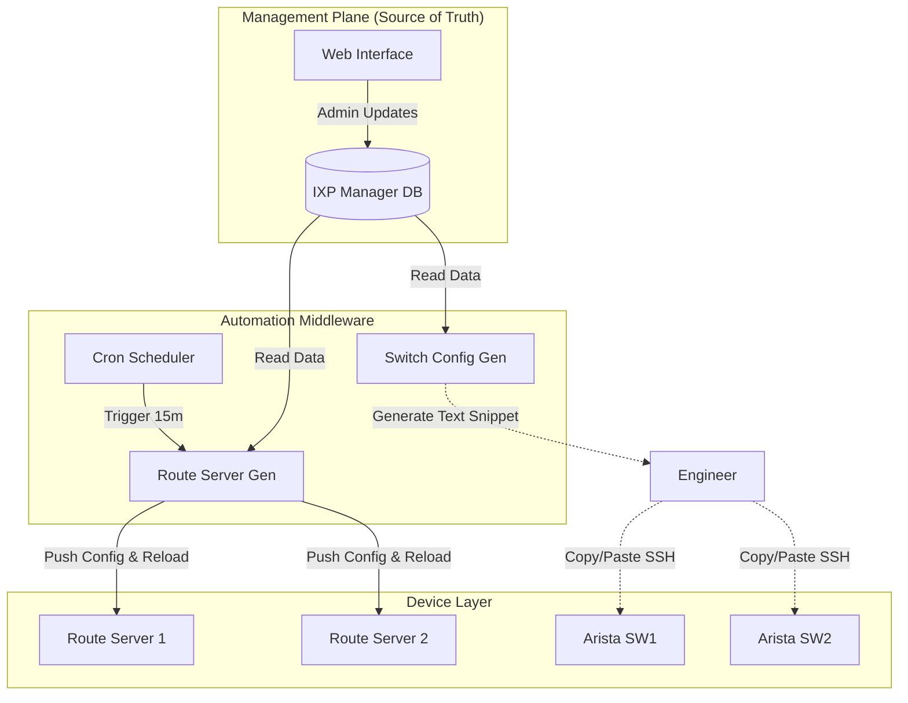

This document outlines the **Automation Strategy** for **PacIXP**.

Given the operating environment (limited staff, high reliability requirements), our strategy follows a **"Source of Truth"** philosophy. We avoid ad-hoc manual changes. Instead, the central database drives the configuration of the network.

---

# PacIXP Automation Strategy

## 1. Core Philosophy: The "Source of Truth"
The fundamental rule of PacIXP automation is:
> **"If it isn't in IXP Manager, it doesn't exist."**

*   **No Manual Spreadsheets:** IPAM (IP Address Management) is handled strictly by IXP Manager.
*   **No Manual BGP Filters:** Route Server filters are generated algorithmically, not hand-coded.
*   **Human-in-the-loop (Initially):** For switch configurations, we generate the config automatically, but a human engineer verifies and applies it. This prevents "automation accidents" from taking down the fabric.

---

## 2. Architecture Diagram

The automation flow moves from the **Management Plane** down to the **Control** and **Data** planes.



---

## 3. Automation Scope by Component

### A. Route Servers (High Automation)
*Status: Fully Automated*

The configuration for BIRD (Route Servers) is too complex to manage manually (thousands of prefix filters).
1.  **Input:** Admin enters Member ASN and IP in IXP Manager.
2.  **Process:**
    *   Cron job runs `ixp-manager-bird-api`.
    *   Script fetches IRR entries (RIPE/APNIC) and RPKI status.
    *   Script generates a monolithic `bird.conf`.
3.  **Execution:** Script performs a `bird -p` (parse check) and then `bird c` (configure/reload).
4.  **Frequency:** Every 15 minutes.

### B. Member Onboarding (Assisted Automation)
*Status: Templated / Workflow Enforced*

When a new ISP joins PacIXP:
1.  **Sales/Admin:** Enters member details in IXP Manager.
2.  **System:** Auto-assigns next available IPv4/IPv6 from the pool.
3.  **System:** Generates a "Welcome Email" PDF with connection details (LOA, IPs, VLANs).
4.  **System:** Generates the specific interface configuration for the switch.

### C. Switch Configuration (Low Automation / Templating)
*Status: Config Generation Only (Safety First)*

Directly automating switch ports via NETCONF/Ansible is risky for a small team if the automation breaks. We use a **"Generate & Apply"** model.
1.  **Template:** We use IXP Manager's "Skinning" feature to create Arista/Juniper templates.
2.  **Generation:** When adding a port, the admin clicks "Generate Configuration."
3.  **Result:** The system outputs the exact CLI block:
    ```eos
    interface Ethernet4
      description MEMBER: TCC-LTD (AS65005)
      switchport access vlan 10
      ...
    ```
4.  **Application:** The engineer pastes this into the switch console.

---

## 4. Monitoring Automation

Automation isn't just about *configuring*; it's about *watching*.

| Metric | Tool | Automation Logic |
| :--- | :--- | :--- |
| **Port Traffic** | MRTG / IXP Manager | **Auto-Discovery:** Cron job scans switches every 5 mins. If a member moves ports, graphs update automatically. |
| **BGP Sessions** | IXP Manager / Birdseye | **State Check:** Polls Route Servers via API. If a session drops, the dashboard updates immediately. |
| **Packet Loss** | Smokeping | **Target Gen:** Script reads Member IP list and updates Smokeping targets file automatically. |

---

## 5. Disaster Recovery Strategy

If the automation server (IXP Manager) dies, the network **must stay up**.

1.  **Decoupled Control Plane:** The Route Servers and Switches run independently of IXP Manager. If the Manager goes offline, BGP sessions stay up. No new filters will be generated, but existing traffic flows.
2.  **Config Backups:**
    *   **Daily:** `Oxidized` or `RANCID` pulls configs from switches and stores them in a Git repository.
    *   **Hourly:** Database dump of IXP Manager to off-site storage.

---

## 6. Future Phase: "Run" (Full Automation)

Once the PacIXP team is comfortable with the "Walk" phase (Assisted Automation), we can move to the "Run" phase (Year 2-3).

*   **Ansible Integration:** Replace the "Copy/Paste" switch config with Ansible playbooks that pull data from the IXP Manager API and push to switches.
*   **Self-Service Portal:** Allow members to update their own MAC addresses or change port speeds via the portal, triggering automated provisioning.

---

## 7. Summary of Tools

*   **Source of Truth:** IXP Manager (Dockerized).
*   **Routing Logic:** BIRD 2 (fed by IXP Manager API).
*   **Switch Logic:** Jinja2 Templates (inside IXP Manager) for human application.
*   **Backup/Diff:** Oxidized (container).
*   **External Data:** PeeringDB API, RPKI Validators (Routinator).
