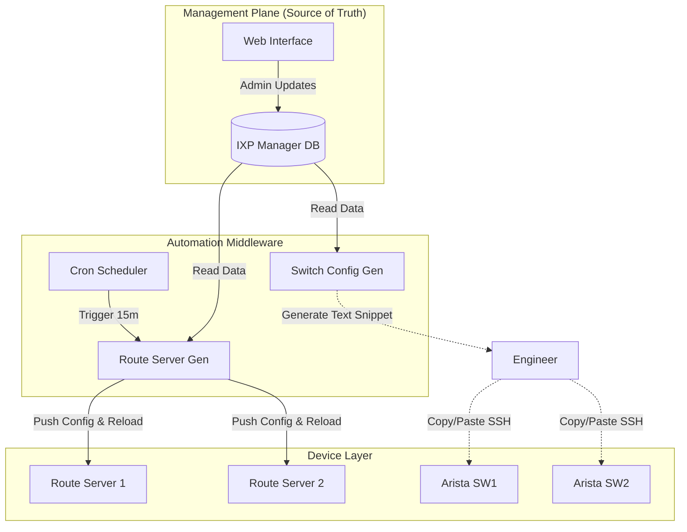

# PACIXP Automation Strategy

## 1. Core Philosophy: The "Source of Truth"
The fundamental rule of PACIXP automation is:
> **"If it isn't in IXP Manager, it doesn't exist."**

*   **No Manual Spreadsheets:** IPAM (IP Address Management) is handled strictly by IXP Manager.
*   **No Manual BGP Filters:** Route Server filters are generated algorithmically, not hand-coded.
*   **Human-in-the-loop (Initially):** For switch configurations, we generate the config automatically, but a human engineer verifies and applies it. This prevents "automation accidents" from taking down the fabric.

---

## 2. Architecture Diagram

The automation flow moves from the **Management Plane** down to the **Control** and **Data** planes.


```mermaid
graph TD
    subgraph "Management Plane (Source of Truth)"
        DB[(IXP Manager DB)]
        GUI[Web Interface]
        GUI -->|Admin Updates| DB
    end

    subgraph "Automation Middleware"
        Script_RS[Route Server Gen]
        Script_SW[Switch Config Gen]
        Cron[Cron Scheduler]
        
        Cron -->|Trigger 15m| Script_RS
        DB -->|Read Data| Script_RS
        DB -->|Read Data| Script_SW
    end

    subgraph "Device Layer"
        RS1[Route Server 1]
        RS2[Route Server 2]
        SW1[Arista SW1]
        SW2[Arista SW2]
    end

    Script_RS -->|Push Config & Reload| RS1
    Script_RS -->|Push Config & Reload| RS2
    
    Script_SW -.->|Generate Text Snippet| Engineer
    Engineer -.->|Copy/Paste SSH| SW1
    Engineer -.->|Copy/Paste SSH| SW2
```

---

## 3. Automation Scope by Component

### A. Route Servers (High Automation)
*Status: Fully Automated*

The configuration for BIRD (Route Servers) is too complex to manage manually (thousands of prefix filters).
1.  **Input:** Admin enters Member ASN and IP in IXP Manager.
2.  **Process:**
    *   Cron job runs `ixp-manager-bird-api`.
    *   Script fetches IRR entries (RIPE/APNIC) and RPKI status.
    *   Script generates a monolithic `bird.conf`.
3.  **Execution:** Script performs a `bird -p` (parse check) and then `bird c` (configure/reload).
4.  **Frequency:** Every 15 minutes.

### B. Member Onboarding (Assisted Automation)
*Status: Templated / Workflow Enforced*

When a new ISP joins PACIXP:
1.  **Sales/Admin:** Enters member details in IXP Manager.
2.  **System:** Auto-assigns next available IPv4/IPv6 from the pool.
3.  **System:** Generates a "Welcome Email" PDF with connection details (LOA, IPs, VLANs).
4.  **System:** Generates the specific interface configuration for the switch.

### C. Switch Configuration (Low Automation / Templating)
*Status: Config Generation Only (Safety First)*

Directly automating switch ports via NETCONF/Ansible is risky for a small team if the automation breaks. We use a **"Generate & Apply"** model.
1.  **Template:** We use IXP Manager's "Skinning" feature to create Arista/Juniper templates.
2.  **Generation:** When adding a port, the admin clicks "Generate Configuration."
3.  **Result:** The system outputs the exact CLI block:
    ```eos
    interface Ethernet4
      description MEMBER: TCC-LTD (AS65005)
      switchport access vlan 10
      ...
    ```
4.  **Application:** The engineer pastes this into the switch console.

---

## 4. Monitoring Automation

Automation isn't just about *configuring*; it's about *watching*.

| Metric | Tool | Automation Logic |
| :--- | :--- | :--- |
| **Port Traffic** | MRTG / IXP Manager | **Auto-Discovery:** Cron job scans switches every 5 mins. If a member moves ports, graphs update automatically. |
| **BGP Sessions** | IXP Manager / Birdseye | **State Check:** Polls Route Servers via API. If a session drops, the dashboard updates immediately. |
| **Packet Loss** | Smokeping | **Target Gen:** Script reads Member IP list and updates Smokeping targets file automatically. |

---

### 5. Disaster Recovery Strategy

If the automation server (IXP Manager) dies, the network **must stay up**.

1.  **Decoupled Control Plane:** The Route Servers and Switches run independently of IXP Manager. If the Manager goes offline, BGP sessions stay up. No new filters will be generated, but existing traffic flows.
2.  **Config Backups (Oxidized):**
    We use **Oxidized** to automatically poll switches and commit changes to a Git repository.

    **Oxidized Setup Instructions**

    1.  **Directory Structure:**
        Create the configuration directory: `mkdir -p /opt/ixp-manager/oxidized`.
    2.  **Configuration (`oxidized/config`):**
        We use the **LibreNMS API** as the source of truth for Oxidized. This ensures any device added to monitoring is automatically backed up.
        ```yaml
        ---
        interval: 3600
        use_syslog: false
        debug: false
        threads: 30
        timeout: 20
        retries: 3
        prompt: !ruby/regexp /^([\w.@()-]+[#>]\s?)$/
        rest: 0.0.0.0:8888
        next_adds_job: false
        vars:
          enable: "your_enable_password"
        groups:
          arista:
            username: admin
            password: your_ssh_password
          juniper:
            username: admin
            password: your_ssh_password
        model_map:
          arista: eos
          juniper: junos
        source:
          default: http
          http:
            url: http://librenms:8000/api/v0/oxidized
            map:
              name: hostname
              model: os
              group: group
            headers:
              X-Auth-Token: "YOUR_LIBRENMS_API_TOKEN"
        output:
          default: git
          git:
            single_repo: true
            local: /root/.config/oxidized/configs.git
        ```

    **LibreNMS + Oxidized Integration**

    To enable the "Config" tab in LibreNMS:
    1.  **LibreNMS Side:** Go to `Global Settings -> External Settings -> Oxidized`.
    2.  **Enable:** Set `Enable Oxidized` to `ON`.
    3.  **URL:** Set `Oxidized URL` to `http://oxidized:8888`.
    4.  **Source:** This configuration allows LibreNMS to feed the device list *to* Oxidized and display the retrieved configs back in the UI.

    **Syslog Trigger (Real-Time Backups)**

    The `interval: 3600` in the Oxidized config is a fallback poll. To capture
    config changes the moment they are committed, switches send syslog to the
    IXP Manager host and rsyslog calls the Oxidized HTTP API immediately.
    This is DP-14: the syslog trigger is the fast path; the polling interval
    is the guaranteed fallback.

    **⚠️ Single rsyslog input — avoid duplicate `$UDPServerRun 514`**

    LibreNMS syslog ingestion (if enabled) will also require rsyslog to receive
    on UDP 514. Duplicate `$UDPServerRun` directives in separate `.conf` files
    will prevent rsyslog from starting. Consolidate all syslog input config into
    one file (`/etc/rsyslog.d/30-network-devices.conf`) that is loaded before
    any per-application rules:

    ```text
    # /etc/rsyslog.d/30-network-devices.conf
    # Single UDP receiver for all network device syslog.
    # Both the Oxidized trigger (below) and any LibreNMS forwarding rules
    # must reference this shared input — never add a second $UDPServerRun 514.

    $ModLoad imudp
    $UDPServerRun 514

    # Trigger Oxidized backup on Arista config commit
    if $fromhost-ip startswith '203.0.113.' \
       and $msg contains 'CONFIG_SESSION_COMMIT' \
       then ^/usr/local/bin/oxidized-trigger;%HOSTNAME%

    # Trigger Oxidized backup on Juniper config commit
    if $fromhost-ip startswith '203.0.113.' \
       and $msg contains 'UI_COMMIT_COMPLETED' \
       then ^/usr/local/bin/oxidized-trigger;%HOSTNAME%

    # LibreNMS syslog forwarding goes here if/when enabled — see LibreNMS docs
    ```

    **⚠️ Hostname matching**

    `%HOSTNAME%` is the value the switch puts in its syslog header — its
    configured `hostname`. Oxidized node names come from LibreNMS, which uses
    SNMP `sysName`. These usually match, but verify by running:

    ```bash
    curl -s http://localhost:8888/nodes | python3 -m json.tool | grep name
    ```

    If the Oxidized node name differs (e.g. FQDN vs short name), the trigger
    silently does nothing and the fallback poll catches the change instead.
    Adjust the trigger script to normalise the name if needed.

    *Trigger script* — `/usr/local/bin/oxidized-trigger`:

    ```bash
    #!/bin/bash
    # Called by rsyslog with the device hostname as $1.
    # Asks Oxidized to immediately poll that node.
    # Uses omprog-compatible single-argument form.
    NODE="$1"
    curl -sf "http://localhost:8888/node/next/${NODE}" >/dev/null
    ```

    ```bash
    chmod +x /usr/local/bin/oxidized-trigger
    systemctl restart rsyslog
    ```

    Switch-side syslog configuration is already included in the Arista and
    Juniper reference configs (`logging host 203.0.113.50` /
    `syslog { host 203.0.113.50 { ... } }`).

3.  **Database Backups:**
    *   **Hourly:** Database dump of IXP Manager to off-site storage.
    *   Example Cron: `0 * * * * docker exec ixp-manager-db-1 mysqldump -u ixp -pPASSWORD ixp > /backups/ixp_$(date +\%H).sql`

---

## 6. Future Phase: "Run" (Full Automation)

Once the PACIXP team is comfortable with the "Walk" phase (Assisted Automation), we can move to the "Run" phase (Year 2-3).

*   **Ansible Integration:** Replace the "Copy/Paste" switch config with Ansible playbooks that pull data from the IXP Manager API and push to switches.
*   **Self-Service Portal:** Allow members to update their own MAC addresses or change port speeds via the portal, triggering automated provisioning.

---

## 7. Summary of Tools

*   **Source of Truth:** IXP Manager (Dockerized).
*   **Routing Logic:** BIRD 2 (fed by IXP Manager API).
*   **Switch Logic:** Jinja2 Templates (inside IXP Manager) for human application.
*   **Backup/Diff:** Oxidized (container).
*   **External Data:** PeeringDB API, RPKI Validators (Routinator).
